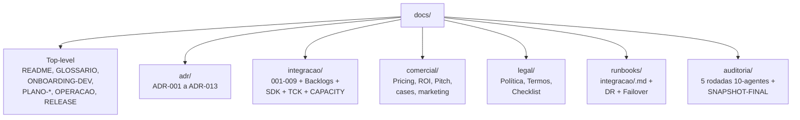

# Documentação — Solution Ticket Desktop

> Owner operacional: `Agent-Orchestrator` | Última revisão: 2026-04-29 | Versão: 6

Esta pasta contém **toda a documentação** do produto: arquitetura, planejamento, comercial, jurídico, runbooks operacionais, ADRs.

> **Execução por agentes de IA:** para o módulo Integração ERP, começar por `integracao/AGENTIC-EXECUTION-OPERATING-MODEL.md`, `integracao/AGENT-EXECUTION-PLAN.md`, `integracao/AGENT-GATES-MATRIX.md`, `integracao/EVIDENCE-MANIFEST.md` e `integracao/EXTERNAL-DEPENDENCIES.md`. Qualquer papel humano citado em documento legado deve ser interpretado pela matriz agentic antes de virar bloqueio.

> ⚠️ **Auditorias 10-agentes (5 rodadas + SNAPSHOT-FINAL)** em 2026-04-26/27: ver `auditoria/`. 22/22 CRITICAL técnicos resolvidos nas Rodadas 1-4; Rodada 5 mapeou novos achados em DevOps/SRE, Comercial, Marketing e Jurídico (`AUDITORIA-10-AGENTES-RODADA-5-2026-04-27.md`). Pendências documentadas em cada doc afetado e no `legal/CHECKLIST-PREENCHIMENTO-LEGAL.md`.

---

## Por onde começar (por papel)

### 🤖 Orquestrador / subagentes de IA

1. `integracao/AGENTIC-EXECUTION-OPERATING-MODEL.md` — regra de precedência e catálogo de subagentes
2. `integracao/AGENT-EXECUTION-PLAN.md` — plano executável por subagentes
3. `integracao/AGENT-GATES-MATRIX.md` — conversão de approvals/assinaturas em evidências
4. `integracao/EVIDENCE-MANIFEST.md` — artefatos obrigatórios por história, sprint e conector
5. `integracao/EXTERNAL-DEPENDENCIES.md` — clientes, contratos, DPO, sandboxes e certificações como dependências externas
6. `integracao/DISCOVERY-BLOCKERS.md` — lacunas factuais por ERP antes de implementar conector real

### 👨‍💻 Novo dev (backend/frontend)

1. **`ONBOARDING-DEV.md`** — roteiro D1-D5 da primeira semana (começar por aqui)
2. `../CLAUDE.md` (raiz do repo) — stack e convenções
3. `integracao/001-arquitetura-integration-hub.md` — visão arquitetural
4. `adr/` — todas as ADRs (decisões arquiteturais)
5. `integracao/BACKLOG-SPRINT-0-1.md` — primeiras histórias

### 🎯 Product Manager

1. `PLANO-MODULO-INTEGRACAO.md` — plano completo 18 meses
2. `comercial/PLANO-COMERCIAL.md` — planos, pricing
3. `integracao/BACKLOG-SPRINT-*.md` — backlogs por sprint
4. `auditoria/SNAPSHOT-FINAL-2026-04-27.md` + `AUDITORIA-10-AGENTES-RODADA-5-2026-04-27.md` — riscos identificados

### 💼 Vendas / Inside Sales

1. `comercial/SALES-TRAINING.md` — onboarding de vendas
2. `comercial/PITCH-DECK.md` — slides padrão
3. `comercial/ROI-CALCULATOR.md` — calculadora de ROI
4. `comercial/EMAIL-TEMPLATES.md` — templates de e-mail
5. `comercial/comparativos/vs-rpa.md` + `vs-integracao-custom.md`
6. `comercial/cases/` — exemplos (anonimizados)

### 🛡️ Suporte L1/L2

1. `integracao/008-runbook-suporte.md` — runbook geral
2. `runbooks/integracao/<erp>.md` — runbook por ERP
3. `integracao/004-outbox-inbox-retry.md` — entender fila

### 🏗️ Tech Lead / Arquiteto

1. `adr/` — todas as 13 ADRs
2. `integracao/001-arquitetura-integration-hub.md` a `009-criterios-homologacao.md`
3. `integracao/SDK-CONNECTOR-SPEC.md` — SDK parceiros
4. `integracao/ESTRATEGIA-RELAY-CLOUD.md` — componente cloud

### ⚖️ Subagente Jurídico / Compliance / LGPD

1. `legal/POLITICA-PRIVACIDADE.md` (rascunho — revisar antes de uso)
2. `legal/TERMOS-USO.md` (rascunho — revisar antes de uso)
3. `integracao/EXTERNAL-DEPENDENCIES.md` — separa pacote agentico de atos externos reais
4. `integracao/005-seguranca-credenciais.md`
5. `integracao/templates/termo-aceite-cliente.md`

### 📈 Marketing

1. `comercial/marketing/WHITEPAPER-CONFIABILIDADE-FISCAL.md`
2. `comercial/marketing/ONE-PAGER-EXECUTIVO.md` + `ONE-PAGER-TECNICO.md`
3. `comercial/cases/` — casos para uso comercial (todos com disclaimer)

---

## Estrutura de pastas

```
docs/
├── README.md                    ← você está aqui
├── GLOSSARIO.md                 ← termos técnicos explicados
├── PLANO-MODULO-INTEGRACAO.md   ← plano-mestre (18 meses, com correções pós-auditoria)
├── GUIA-INTEGRACAO-ERP.md       ← referência técnica abrangente
├── OPERACAO/RELEASE/...         ← documentos operacionais do produto base
│
├── adr/                         ← Architecture Decision Records (13 ADRs)
│   ├── ADR-001 a ADR-009        (decisões originais)
│   ├── ADR-010-modelo-tenancy.md         (resolve C1)
│   ├── ADR-011-engine-mapping-jsonata.md (resolve H3)
│   ├── ADR-012-oauth-em-desktop.md       (resolve H10)
│   └── ADR-013-api-publica-porta-separada.md (resolve H4)
│
├── integracao/                  ← documentação técnica do módulo
│   ├── AGENTIC-EXECUTION-OPERATING-MODEL.md  ← regra agent-first
│   ├── AGENT-EXECUTION-PLAN.md               ← plano executável por agentes
│   ├── AGENT-GATES-MATRIX.md                 ← gates humanos → evidências
│   ├── EVIDENCE-MANIFEST.md                  ← artefatos obrigatórios
│   ├── EXTERNAL-DEPENDENCIES.md              ← dependências externas/fallback
│   ├── DISCOVERY-BLOCKERS.md                 ← lacunas factuais de ERP
│   ├── 001 a 009 (docs técnicos numerados)
│   ├── BACKLOG-SPRINT-0-1, 2, 3, 4, 5, 6-7-8, 9-10-11
│   ├── REPLANEJAMENTO-STORY-POINTS.md   (resolve C6)
│   ├── REFACTOR-CANONICO-EXTENSIONS.md  (resolve H1)
│   ├── CAPACITY.md                       (resolve C5)
│   ├── TCK-SPEC.md                       (resolve H12)
│   ├── PLANO-HOMOLOGACAO-CONECTOR.md
│   ├── ESTRATEGIA-RELAY-CLOUD.md         (anti-replay corrigido)
│   ├── SDK-CONNECTOR-SPEC.md
│   ├── contratos/               ← 6 contratos ERP (Sankhya/Protheus/SAP corrigidos)
│   └── templates/               ← 3 templates reutilizáveis
│
├── comercial/                   ← vendas/marketing
│   ├── PLANO-COMERCIAL.md            (§10 recalibrado)
│   ├── PITCH-DECK.md
│   ├── ROI-CALCULATOR.md             (premissas recalibradas)
│   ├── PROJECAO-COMERCIAL-RECALIBRADA.md  (resolve C7)
│   ├── PLAYBOOK-MEDIO-BR.md          (doce-spot dedicado)
│   ├── SALES-TRAINING.md
│   ├── EMAIL-TEMPLATES.md
│   ├── cases/                   ← 4 cases ⚠ FICTÍCIOS com disclaimer
│   ├── comparativos/            ← vs RPA, vs custom
│   └── marketing/               ← whitepaper, one-pagers
│
├── legal/                       ← política, termos (com correções pós-auditoria)
│   ├── POLITICA-PRIVACIDADE.md       (§9 corrigida — DPA "em formalização")
│   ├── TERMOS-USO.md                 (§10 simétrica + §16 CAM-CCBC)
│   └── CHECKLIST-PREENCHIMENTO-LEGAL.md
│
├── runbooks/                    ← runbooks operacionais
│   └── integracao/              ← 6 runbooks ERP + DR DPAPI + Failover Cloudflare
│       ├── bling.md, omie.md, conta-azul.md, sankhya.md
│       ├── totvs-protheus.md, sap-s4hana.md
│       ├── dr-dpapi.md                    (resolve H8)
│       └── failover-cloudflare-aws.md     (resolve N3)
│
└── auditoria/
    ├── AUDITORIA-10-AGENTES-2026-04-26.md             (Rodada 1)
    ├── AUDITORIA-10-AGENTES-RODADA-2-2026-04-26.md    (Rodada 2)
    ├── AUDITORIA-10-AGENTES-RODADA-3-2026-04-27.md    (Rodada 3)
    ├── AUDITORIA-10-AGENTES-RODADA-5-2026-04-27.md    (Rodada 5)
    ├── CORRECOES-APLICADAS-2026-04-26.md              (pós R1+R2)
    ├── CORRECOES-APLICADAS-RODADA-3-2026-04-27.md     (pós R3)
    ├── CORRECOES-APLICADAS-RODADA-4-2026-04-27.md     (pós R4)
    ├── SNAPSHOT-FINAL-2026-04-27.md                   (consolidação R1-R4)
    └── historico/                ← 9 auditorias antigas
```

---

## Convenções de nomenclatura

| Padrão                | Quando usar                                    | Exemplo                              |
| --------------------- | ---------------------------------------------- | ------------------------------------ |
| `001-kebab-case.md`   | docs técnicos numerados (sequência de leitura) | `001-arquitetura-integration-hub.md` |
| `ADR-NNN-titulo.md`   | Architecture Decision Records                  | `ADR-010-modelo-tenancy.md`          |
| `BACKLOG-SPRINT-N.md` | backlogs por sprint                            | `BACKLOG-SPRINT-0-1.md`              |
| `UPPER-CASE.md`       | documentos canônicos top-level (planos, guias) | `PLANO-COMERCIAL.md`                 |
| `kebab-case.md`       | runbooks e contratos por ERP                   | `bling.md`, `sap-s4hana.md`          |
| `EXEMPLO-*.md`        | casos/exemplos fictícios (com disclaimer)      | `EXEMPLO-CASE-AGRO-COOPERATIVA.md`   |

---

## Status dos documentos (pós-correções 2026-04-27)

| Documento                                   | Status                                                                                                     |
| ------------------------------------------- | ---------------------------------------------------------------------------------------------------------- |
| Documentação técnica (`integracao/001-009`) | ✅ Atualizada (006 = JSONata, 002 = extensions)                                                            |
| Backlogs sprints                            | ✅ Story points recalibrados (S2:23, S3:25, S4:25, S5:28)                                                  |
| Contratos ERP                               | ⚠️ Sankhya/Protheus/SAP corrigidos textualmente — Discovery profundo no Sprint 6                           |
| ROI Calculator                              | ✅ Premissas conservadoras (70/70/80/50%) defensáveis                                                      |
| ADRs                                        | ✅ 22 ADRs                                                                                                 |
| Execução agentic                            | ✅ Modelo operacional, matriz de gates, evidence manifest e dependências externas criados                  |
| Documentos legais                           | ⚠️ Estrutura corrigida (foro CAM-CCBC SP, multas simétricas) — **dados empresa pendentes** (ver CHECKLIST) |
| Cases comerciais                            | ⚠️ Disclaimer prominente — substituir por cases reais quando houver cliente piloto                         |
| Capacity / TCK / DR                         | ✅ Specs criadas (CAPACITY.md, TCK-SPEC.md, dr-dpapi.md, failover-cloudflare-aws.md)                       |

---

## Glossário rápido

Para termos técnicos completos: `GLOSSARIO.md`.

- **Outbox**: tabela onde eventos aguardam envio ao ERP
- **DLQ (Dead Letter Queue)**: fila de eventos que falharam definitivamente
- **Idempotência**: operação que pode ser repetida sem efeito duplicado
- **Mapping engine**: motor que traduz dados canônicos para formato do ERP
- **Conector**: adapter para um ERP específico
- **Hub**: o módulo de integração como um todo
- **Relay**: componente cloud que recebe webhooks do ERP

---

## Manutenção

- Revisar este README **trimestralmente** ou quando a matriz agentic mudar
- Atualizar quando adicionar/mover documento
- Versão atual: 6 (2026-04-29)

---

## Organização de pastas (visão rápida)


