# 001 — Arquitetura do Integration Hub

> Owner: Eng | Última revisão: 2026-04-27 | Versão: 5

**Versão**: 1.0 — 2026-04-26
**Status**: Aprovado
**Audiência**: Tech Lead, Devs, Arquitetos, novos contratados do time

Este documento é o **ponto de entrada técnico** do módulo de integração. Outros documentos (`002`, `003`, ...) detalham subsistemas específicos.

---

## 1. Visão geral

O Integration Hub é uma **camada independente** dentro do Solution Ticket, responsável por toda comunicação com sistemas externos (ERPs, iPaaS, sistemas legados).

### 1.1 Princípios fundamentais (resumo dos ADRs)

- **Local-first** (ADR-002, ADR-006): backend continua em `127.0.0.1`; outbox em SQLite local
- **Anti-Corruption Layer** (ADR-001): módulo isolado, módulos de negócio não conhecem ERPs
- **Modelo canônico versionado** (ADR-003): contrato único entre módulos e conectores
- **Conectores plugáveis** (ADR-005): Strategy pattern, registry dinâmico
- **Mapping declarativo** (ADR-007): YAML versionado por perfil
- **Webhooks via relay cloud** (ADR-008): backend nunca exposto
- **Single-tenant por instalação** (ADR-010): cada Solution Ticket é um tenant; rate limit, cofre e fingerprint vinculam-se à instalação, não a "organizações" de SaaS multi-tenant
- **Split de portas HTTP** (ADR-013): backend interno em `:3001` (loopback), API pública em `:3002` (loopback default, LAN com TLS opt-in) — defesa em profundidade
- **Modelo de consistência outbox/inbox** (ADR-014): FIFO por `entityId`, at-least-once + dedup via idempotencyKey, reconciliação por revision, DLQ TTL 90d, SENT→CONFIRMED com timeout

### 1.2 Topologia em alto nível

```mermaid
flowchart LR
    Cliente[Cliente externo<br/>iPaaS / script]
    APIPub[API pública<br/>NestJS :3002]
    HubInt[Hub interno<br/>NestJS :3001]
    Outbox[(integracao_outbox<br/>SQLite local)]
    Workers[Workers<br/>QueueWorkerService]
    ERP[ERP<br/>Bling / Omie / SAP / ...]
    Webhook[Webhook entrante<br/>via Relay Cloud]
    Inbox[(integracao_inbox<br/>SQLite local)]

    Cliente -->|HTTPS + API Key| APIPub
    APIPub -->|enqueue interno| HubInt
    HubInt --> Outbox
    Outbox --> Workers
    Workers -->|push| ERP
    ERP -.->|webhook async| Webhook
    Webhook -->|long-poll agent| Inbox
    Inbox --> HubInt

    classDef cloud fill:#e0f0ff,stroke:#0066cc
    classDef local fill:#e8ffe8,stroke:#0a8a0a
    class Cliente,Webhook,ERP cloud
    class APIPub,HubInt,Outbox,Workers,Inbox local
```



**Legenda**:

- Azul = superfície externa/cloud (não há dado em repouso fora de TLS).
- Verde = processo local na máquina do cliente (`127.0.0.1`).
- Setas sólidas = fluxo síncrono iniciado pelo lado origem.
- Seta tracejada = entrega assíncrona do ERP (webhook), que **nunca** atinge `127.0.0.1` diretamente — sempre passa pelo Relay Cloud + agent local fazendo long-polling de saída.

---

## 2. Arquitetura em camadas

```
┌─────────────────────────────────────────────────────────────┐
│  Módulos de Negócio (ticket, romaneio, fatura, cadastros)   │
│  Emitem eventos de domínio (NestJS EventEmitter2)            │
└──────────────────────────┬──────────────────────────────────┘
                           │
                           │  domain events
                           ▼
┌─────────────────────────────────────────────────────────────┐
│  Integration Hub                                             │
│                                                              │
│  ┌────────────────────────────────────────────────────────┐ │
│  │  Event Listener Layer                                  │ │
│  │  DomainEventListenerService                            │ │
│  │  IntegrationEventFactoryService                        │ │
│  └────────────────────────┬───────────────────────────────┘ │
│                           ▼                                 │
│  ┌────────────────────────────────────────────────────────┐ │
│  │  Outbox Layer (transacional)                           │ │
│  │  OutboxService (enqueue) | InboxService                │ │
│  └────────────────────────┬───────────────────────────────┘ │
│                           ▼                                 │
│  ┌────────────────────────────────────────────────────────┐ │
│  │  Worker Layer                                          │ │
│  │  QueueWorkerService (lock + dispatch)                  │ │
│  │  RetryPolicyService | DeadLetterService                │ │
│  └────────────────────────┬───────────────────────────────┘ │
│                           ▼                                 │
│  ┌────────────────────────────────────────────────────────┐ │
│  │  Mapping Layer                                         │ │
│  │  MappingEngineService                                  │ │
│  │  TransformationService | ValidationService             │ │
│  │  EquivalenceTableService                               │ │
│  └────────────────────────┬───────────────────────────────┘ │
│                           ▼                                 │
│  ┌────────────────────────────────────────────────────────┐ │
│  │  Connector Layer (Strategy)                            │ │
│  │  ConnectorRegistryService | ConnectorFactoryService    │ │
│  │  IErpConnector implementations                         │ │
│  │  - MockConnector (dev/test)                            │ │
│  │  - GenericRestConnector / Csv / Sftp / Soap            │ │
│  │  - BlingConnector / OmieConnector / SapConnector ...   │ │
│  └────────────────────────┬───────────────────────────────┘ │
│                           ▼                                 │
│  ┌────────────────────────────────────────────────────────┐ │
│  │  Infrastructure Cross-cutting                          │ │
│  │  SecretManagerService (DPAPI)                          │ │
│  │  IntegrationLogService (mascarado)                     │ │
│  │  HealthcheckService | MetricsService                   │ │
│  └────────────────────────────────────────────────────────┘ │
└──────────────────────────┬──────────────────────────────────┘
                           ▼
              ERPs / iPaaS / SFTP / DB / Webhooks
```

---

## 3. Estrutura de pastas

```
backend/src/integracao/
  integracao.module.ts

  api/                      → controllers (públicos e admin)
  canonical/                → schemas DTO canônicos versionados (v1/, v2/)
  events/                   → eventos de integração + factory
  queue/                    → outbox, inbox, worker, retry, DLQ
  mapping/                  → engine, transformações, validação
  connectors/               → cada conector em subpasta
  sync/                     → orquestração, checkpoint, reconciliação
  security/                 → cofre, assinaturas, rotação
  observability/            → logs, métricas, support bundle
  relay/                    → agent local do relay cloud
```

Detalhes em `docs/PLANO-MODULO-INTEGRACAO.md` seção 5.2.

---

## 4. Fluxos principais

### 4.1 Push (Solution Ticket → ERP)

```
1. Módulo de negócio fecha ticket
2. Emite WeighingTicketClosedEvent
3. DomainEventListener captura
4. IntegrationEventFactory cria IntegrationEvent canônico
5. OutboxService.enqueue() — TRANSACIONAL com fechamento do ticket
6. Worker (em loop) faz lock e pega N eventos PENDING
7. Para cada evento:
   a. Resolve profile + connector
   b. MappingEngine traduz canônico → payload do ERP
   c. ValidationService valida pré-envio
   d. Connector.pushEvent() chama o ERP
   e. Sucesso → status = SENT/CONFIRMED, external_link gravado
   f. Erro técnico → retry com backoff
   g. Erro de negócio → DLQ
8. IntegrationLog registra payload mascarado + resposta
```

### 4.2 Pull (ERP → Solution Ticket)

```
1. SyncOrchestrator dispara pull periódico (cron por entidade)
2. Connector.pullChanges(checkpoint) busca delta
3. Para cada item:
   a. Mapping ERP → canônico
   b. Persistido em entidades locais (com flag "vindo do ERP")
   c. external_link atualizado
4. Checkpoint atualizado para próxima execução
```

### 4.3 Webhook entrante (via relay cloud)

```
1. ERP envia POST → Relay Cloud
2. Relay valida HMAC do ERP, persiste em fila do tenant
3. Inbound Agent (local) faz long-polling, recebe evento
4. Grava em integracao_inbox com idempotency
5. InboxProcessor lê inbox, dispara conector apropriado
6. Conector traduz e atualiza estado local
```

Detalhes do relay em `docs/integracao/ESTRATEGIA-RELAY-CLOUD.md`.

---

## 5. Persistência

13 tabelas Prisma com prefixo `integracao_`. Detalhes em `docs/integracao/004-outbox-inbox-retry.md`.

Princípios:

- Separação clara entre tabelas do hub e tabelas de negócio (sem alterar `tpesagens`, `tclientes`, etc.)
- Vínculo via `integracao_external_link` (entidade local ↔ external ID)
- Logs append-only com TTL configurável (auditoria fiscal: 5 anos)

---

## 6. Segurança

- Credenciais protegidas via Windows DPAPI (ADR-004)
- Mascaramento automático de payload em logs
- Permissões granulares (10 permissões `INTEGRACAO_*`)
- TLS obrigatório fora de localhost
- Backend nunca exposto na internet (ADR-006)

Detalhes em `docs/integracao/005-seguranca-credenciais.md`.

---

## 7. Observabilidade

- Logs estruturados em JSON (Pino) com correlation ID propagado
- Métricas Prometheus em `/metrics` (apenas localhost)
- OpenTelemetry tracing para chamadas externas
- Dashboard frontend em tempo real
- Support bundle exportável para suporte

Detalhes em `docs/integracao/008-runbook-suporte.md`.

---

## 8. Resiliência

- Outbox transacional — at-least-once garantido
- Retry com backoff exponencial + jitter
- Circuit breaker por endpoint
- Bulkhead — pool isolado por cliente
- Dead-letter queue com reprocessamento manual
- Recovery de eventos órfãos (`PROCESSING` há > 10min → `PENDING`)

---

## 9. Extensibilidade

Adicionar conector novo:

1. Criar pasta `connectors/<erp>/`
2. Implementar `IErpConnector`
3. Definir mapping YAML default
4. Registrar no `ConnectorRegistryService`
5. Aplicar Playbook Universal (PLANO seção 13)

**Não há mudanças no core** — princípio Open/Closed respeitado.

---

## 10. Documentos relacionados

| Documento                        | Conteúdo                           |
| -------------------------------- | ---------------------------------- |
| `002-modelo-canonico.md`         | Schemas DTO detalhados             |
| `003-api-publica-v1.md`          | Especificação completa da API REST |
| `004-outbox-inbox-retry.md`      | Fila, retry, DLQ detalhados        |
| `005-seguranca-credenciais.md`   | DPAPI, mascaramento, permissões    |
| `006-mapping-engine.md`          | Engine de transformação YAML       |
| `007-playbook-conectores-erp.md` | Como criar conector novo           |
| `008-runbook-suporte.md`         | Guia operacional de suporte        |
| `009-criterios-homologacao.md`   | Plano de homologação               |
| `ESTRATEGIA-RELAY-CLOUD.md`      | Componente cloud para webhooks     |
| `PLANO-MODULO-INTEGRACAO.md`     | Plano completo de execução         |
| `GUIA-INTEGRACAO-ERP.md`         | Referência técnica abrangente      |
| ADRs em `docs/adr/`              | Decisões arquiteturais formais     |
