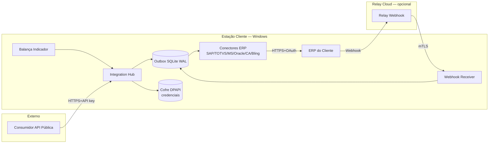

# Threat Model — Módulo Integração ERP

> **Escopo:** módulo de integração ERP do Solution Ticket Desktop (Hub, Outbox, Conectores, Relay Cloud, API pública).
> **Metodologia:** STRIDE (segurança) + LINDDUN (privacidade/LGPD).
> **Owner agentico:** `Security-Agent` + `LGPD-Legal-Agent`.
> **Revisão obrigatória:** por épico em `BACKLOG-SPRINT-*` e antes de GA por conector.

---

## 1. Diagrama de fluxo de dados

**Ativos críticos:**

1. Cofre DPAPI (credenciais OAuth, API keys, tokens fornecedor).
2. Outbox SQLite (payloads fiscais, CPF, CNPJ, placa).
3. Relay Cloud (proxy de webhooks).
4. API pública v1 (superfície externa).
5. Tokens de conector (OAuth refresh tokens).
6. Chave RSA `keygen/private.key` (assinatura de licença).
7. Logs de auditoria (hash chain).

---

## 2. STRIDE × Ativos

| #   | Ativo                | Threat STRIDE         | Cenário                                                                                                                                                                                                                               | Mitigação atual                                                                                                                                                                                                                            | Risco residual                                                            |
| --- | -------------------- | --------------------- | ------------------------------------------------------------------------------------------------------------------------------------------------------------------------------------------------------------------------------------- | ------------------------------------------------------------------------------------------------------------------------------------------------------------------------------------------------------------------------------------------ | ------------------------------------------------------------------------- |
| 1   | Cofre DPAPI          | **S**poofing          | Outro usuário Windows tenta abrir cofre                                                                                                                                                                                               | DPAPI CurrentUser (ADR-016)                                                                                                                                                                                                                | Baixo (limitado a sessão Windows)                                         |
| 2   | Cofre DPAPI          | **T**ampering         | Atacante substitui blob criptografado                                                                                                                                                                                                 | Hash do blob em SQLite separado                                                                                                                                                                                                            | Médio — falta MAC integrado                                               |
| 3   | Cofre DPAPI          | **I**nfo disclosure   | Backup do `%AppData%` exposto                                                                                                                                                                                                         | DPAPI vincula à máquina+user                                                                                                                                                                                                               | Baixo                                                                     |
| 4   | Outbox SQLite        | **T**ampering         | Edição direta do .db por suporte                                                                                                                                                                                                      | WAL + audit log + hash chain (ADR-018)                                                                                                                                                                                                     | Médio                                                                     |
| 5   | Outbox SQLite        | **I**nfo disclosure   | CPF/placa em payload em claro                                                                                                                                                                                                         | Mascaramento em UI (ADR-pendente PII)                                                                                                                                                                                                      | **Alto** — payload cru em disco                                           |
| 6   | Relay Cloud          | **S**poofing          | ERP malicioso envia webhook falso                                                                                                                                                                                                     | mTLS + assinatura HMAC                                                                                                                                                                                                                     | Baixo                                                                     |
| 7   | Relay Cloud          | **D**oS               | Flood de webhooks no relay                                                                                                                                                                                                            | Rate limit Cloudflare + WAF                                                                                                                                                                                                                | Médio                                                                     |
| 8   | Relay Cloud          | **R**epudiation       | Cliente nega ter recebido webhook                                                                                                                                                                                                     | Log imutável Cloudflare R2 + hash chain                                                                                                                                                                                                    | Baixo                                                                     |
| 9   | API pública          | **S**poofing          | Uso de API key vazada                                                                                                                                                                                                                 | Rotação ≤90d + IP allowlist opcional                                                                                                                                                                                                       | Médio                                                                     |
| 10  | API pública          | **E**oP               | Escalação via endpoint admin sem RBAC                                                                                                                                                                                                 | Matriz §12.2 + JWT scopes                                                                                                                                                                                                                  | Médio                                                                     |
| 11  | API pública          | **D**oS               | Brute force / scraping                                                                                                                                                                                                                | Rate limit por API key (token bucket)                                                                                                                                                                                                      | Médio                                                                     |
| 12  | OAuth tokens         | **I**nfo disclosure   | Refresh token em log                                                                                                                                                                                                                  | Redaction obrigatório no logger (ADR-019)                                                                                                                                                                                                  | Baixo                                                                     |
| 13  | OAuth tokens         | **T**ampering         | MITM rouba e replay token                                                                                                                                                                                                             | TLS pinning + short-lived access token                                                                                                                                                                                                     | Baixo                                                                     |
| 14  | Chave RSA licença    | **I**nfo disclosure   | Vazamento da privada → pirataria total                                                                                                                                                                                                | Cofre fornecedor (ver SECRETS-MANAGEMENT.md)                                                                                                                                                                                               | **Crítico se vazar**                                                      |
| 15  | Logs auditoria       | **T**ampering         | Apagar evidência pós-incidente                                                                                                                                                                                                        | Hash chain encadeada + replicação Sev1                                                                                                                                                                                                     | Baixo                                                                     |
| 16  | Fingerprint auth ERP | **D**oS / Repudiation | Troca de hardware (HD, MAC, placa-mãe) muda fingerprint e quebra integração silenciosamente — cliente perde envio fiscal sem alerta claro; pior caso: tickets ficam acumulados na outbox até o usuário perceber, gerando perda fiscal | Detecção de mismatch no startup + fluxo `RE_BINDING_REQUIRED` (ADR-016 §"Fingerprint de auth ERP") + alerta SLA-driven em ≤15 min via observability pipeline (ADR-017) + alerta no relay quando cliente para de testemunhar (ADR-018 §2.3) | Médio — depende de execução do fluxo de re-binding e alerta cross-domínio |

---

## 3. LINDDUN — Privacidade (LGPD)

PII envolvida: **CPF do motorista, CNPJ do cliente/transportadora, placa, nome, telefone**.

| #   | Categoria LINDDUN            | Cenário                                                        | Mitigação                                                              | Status               |
| --- | ---------------------------- | -------------------------------------------------------------- | ---------------------------------------------------------------------- | -------------------- |
| L1  | **L**inkability              | Correlação de placas entre clientes via relay compartilhado    | Tenancy isolation no relay; chaves por cliente                         | Implementado         |
| L2  | **I**dentifiability          | CPF visível em UI de operador comum                            | Mascaramento default (`***.***.***-XX`)                                | A implementar        |
| L3  | **N**on-repudiation indevida | Audit log eterno expõe atividade de operador desligado         | Retenção configurável (MATRIZ-RETENCAO)                                | A definir            |
| L4  | **D**etectability            | Existência de registro de motorista revela presença do veículo | Acesso restrito a Auditor/DPO                                          | Implementado         |
| L5  | **D**isclosure of info       | Payload com CPF cru exportado para suporte                     | Export sempre mascarado (`INTEGRACAO_VER_PAYLOAD_CRU` exige permissão) | A implementar        |
| L6  | **U**nawareness              | Titular não sabe que dado foi enviado a ERP                    | Aviso no termo + portal do titular                                     | Pendente             |
| L7  | **N**on-compliance           | Retenção > prazo LGPD                                          | DPIA + retenção automática                                             | DPIA template criado |

---

## 4. Top 10 threats priorizadas

| Prio | Severidade  | Threat                                    | Plano                                          |
| ---- | ----------- | ----------------------------------------- | ---------------------------------------------- |
| 1    | **Crítica** | Vazamento da chave RSA de licença (#14)   | Cofre fornecedor + rotação anual + revogação   |
| 2    | **Alta**    | CPF/placa em payload outbox em claro (#5) | Field-level encryption nos campos PII          |
| 3    | **Alta**    | API key vazada com escopo amplo (#9, #10) | Scopes granulares + rotação + monitoring       |
| 4    | **Alta**    | Atacante edita SQLite outbox (#4)         | MAC HMAC por linha + alarme no startup         |
| 5    | **Média**   | Refresh token em log (#12)                | Auditoria automática de logs no CI             |
| 6    | **Média**   | DoS no relay cloud (#7)                   | Cloudflare WAF + circuit breaker               |
| 7    | **Média**   | DoS na API pública (#11)                  | Rate limit por tenant + alerta                 |
| 8    | **Média**   | Substituição de blob DPAPI (#2)           | MAC + verificação na abertura                  |
| 9    | **Média**   | LINDDUN L2 — CPF visível default          | Mascaramento UI default + permissão `_VER_CRU` |
| 10   | **Média**   | LINDDUN L6 — não-ciência do titular       | Atualizar termo + aviso no app                 |

---

## 5. Processo de revisão agentic

- **Revisão obrigatória por `Security-Agent` antes de Sprint 1** — entregável de Sprint 0. Sem evidence pack (`semgrep`, `gitleaks`, checklist STRIDE/LINDDUN e decision record), nenhuma história crítica de Sprint 1 entra em desenvolvimento.
- **Registro de revisão** — o agente cria `docs/auditoria/agentic/<data>-threat-model-review.md` com achados, severidade, riscos aceitos e hashes dos artefatos. Não exige assinatura humana.
- **Re-revisão por épico:** todo `BACKLOG-SPRINT-N.md` lista threats novas introduzidas; PR/merge agentico não fecha sem item correspondente + re-review se a revisão alterar Top 10 ou adicionar ativo crítico.
- **Pré-`TECH_READY` por conector:** rerun completo STRIDE+LINDDUN + SAST/DAST/secret scan. Pentest externo, quando exigido por SAP/TOTVS, é `BLOCKED_EXTERNAL` para `COMMERCIAL_GA_READY`.
- **Pós-incidente:** atualizar tabela e revisar Top 10 em até 30 dias via `Incident-Agent` + `Security-Agent`.
- **Trimestral:** `Security-Agent`, `LGPD-Legal-Agent` e `SRE-Agent` revisam matriz e ajustam prioridades.

---

## 6. Cross-links

- ADR-016 (DPAPI) — mitigação #1, #2, #3
- ADR-018 (Audit log hash chain) — mitigação #4, #15
- ADR-019 (Logger redaction) — mitigação #12
- ADR-020 (Supply chain) — protege superfície de build
- DPIA-TEMPLATE.md — instrumento LGPD
- SECRETS-MANAGEMENT.md — cofres
- SECURITY-INCIDENT-PLAYBOOK.md — resposta
- ON-CALL.md — escalação
- MATRIZ-RETENCAO — controle de retenção LGPD
